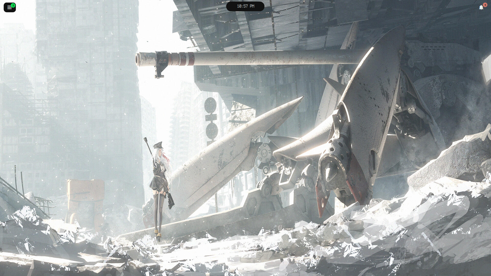
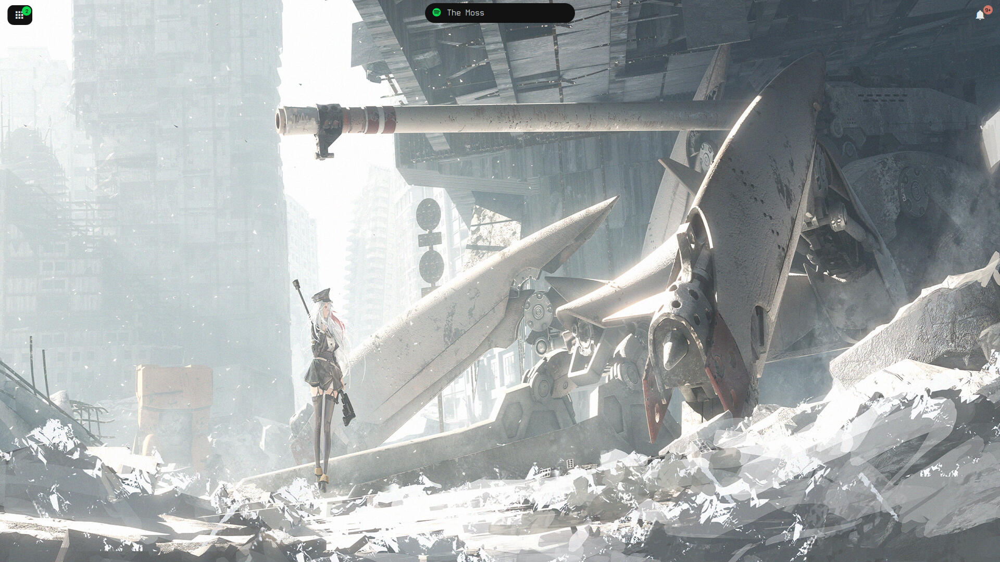
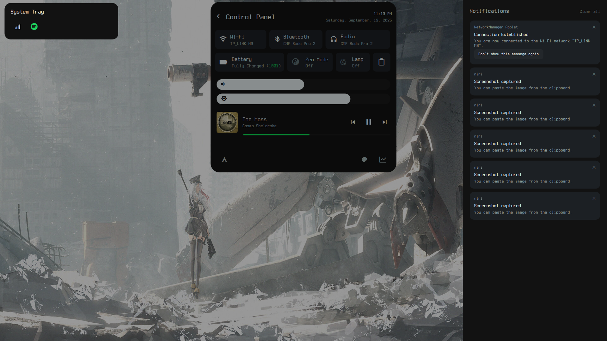
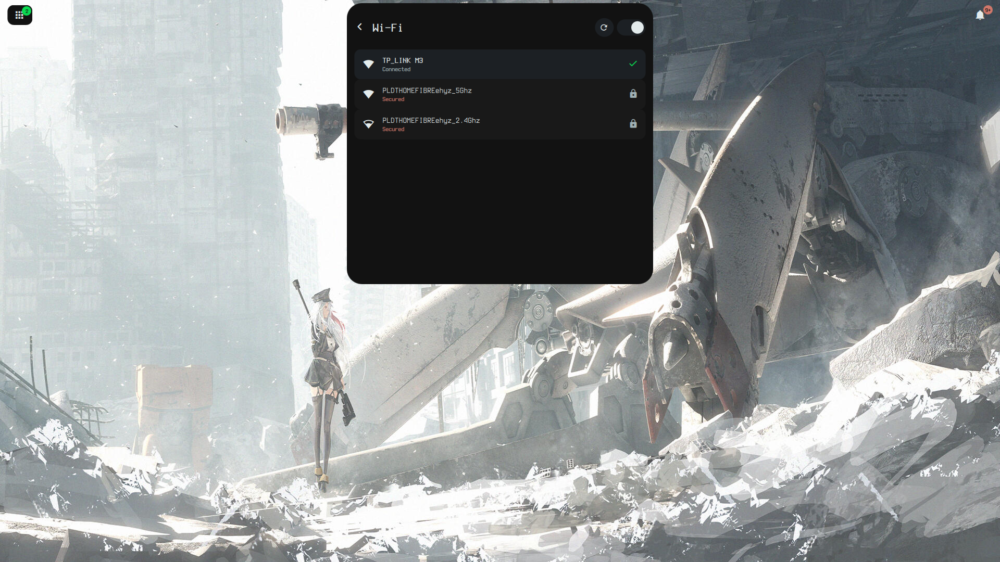
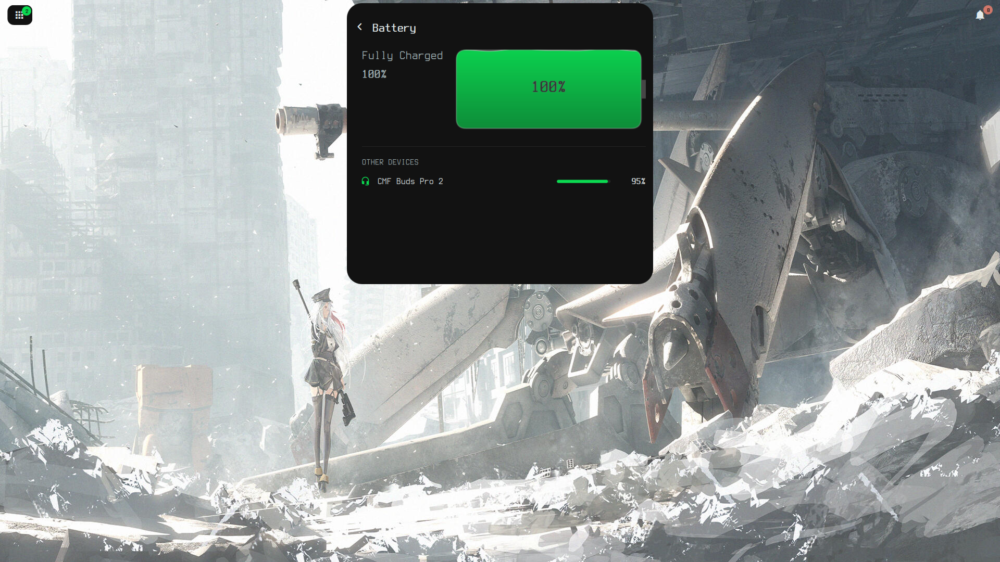
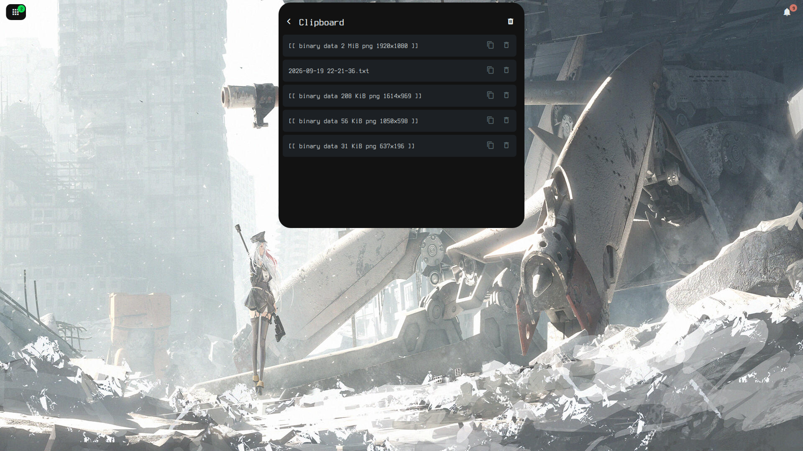

<div align="center">

# Zenplify

**A minimalist, morphing desktop shell for [niri](https://github.com/YaLTeR/niri) — built with [Quickshell](https://quickshell.org).**

One pill that morphs into everything: clock, media, volume, brightness, workspaces, and a full control panel.


<!-- Optional hero shot: drop a wide banner image at assets/hero.png -->
<!--  -->

</div>

---

## 📖 Table of Contents

- [Demo](#-demo)
- [Screenshots](#-screenshots)
- [Inspiration](#-inspiration)
- [Features](#-features)
- [How It Works](#-how-it-works)
- [Requirements](#-requirements)
- [Installation](#-installation)
- [Customization](#-customization)
- [Project Structure](#-project-structure)
- [Limitations & Known Issues](#-limitations--known-issues)
- [Roadmap](#-roadmap)
- [Acknowledgements](#-acknowledgements)
- [License](#-license)

---

## 🎥 Demo

> A short walkthrough of the pill morphing, the control panel, notifications, and the system tray.

<!--
HOW TO ADD THE VIDEO:
Option A (recommended, hosted by GitHub):
  Open this README in the GitHub web editor, then drag-and-drop your .mp4/.mov
  into the editor. GitHub uploads it and inserts a
  https://github.com/user-attachments/assets/... link that plays inline.
  Paste that link right below this comment.

Option B (YouTube thumbnail that links to the video):
  [](https://youtu.be/YOUR_VIDEO_ID)
-->

<!-- 📹 Paste your demo video link here -->

_Demo video coming soon._

---

## 📸 Screenshots

<!--
HOW TO ADD SCREENSHOTS:
  1. Create an `assets/` folder in the repo root.
  2. Drop your images in (e.g. assets/pill.png, assets/panel.png, ...).
  3. Uncomment the rows below and adjust the filenames/captions.
-->

<div align="center">


| Collapsed pill | Now playing |
|:---:|:---:|
|  |  |

| Control panel | Wi-Fi module |
|:---:|:---:|
|  |  |

| Battery | Clipboard |
|:---:|:---:|
|  |  |


<!-- _Screenshots coming soon — add them under `assets/`._ -->

</div>

---

## 💡 Inspiration

Zenplify grew out of the Linux **ricing** philosophy: a desktop that is lightweight, unobtrusive, and entirely yours. Rather than a traditional always-on status bar packed with widgets, Zenplify collapses everything into a single **morphing pill** at the top of the screen — quiet when you don't need it, and unfolding into a full control panel when you do.

The morph itself is inspired by the "dynamic island" interaction: one surface that reshapes to fit the moment — a clock, a now-playing strip, a volume nudge, a workspace switch — instead of a wall of permanent indicators. The goal is a shell that feels calm at rest and capable on demand, while staying hackable QML you can read top-to-bottom.

<!-- Feel free to expand this with your own story / what pushed you to build it. -->

---

## ✨ Features

### The Pill (bar mode)
- **Morphing surface** — a single pill that animates between a compact bar and a full panel (`width` / `height` / `radius` transitions).
- **Clock** — time at a glance when nothing else is happening.
- **Now playing** — a compact media strip appears in the pill while Spotify has a track.
- **Transient flashes** — volume, brightness, and workspace changes briefly take over the pill (~2s) then revert, so feedback is there when you act and gone when you don't.

### Control Panel (expanded pill)
- **Volume & brightness sliders** — draggable, wired to live services.
- **Audio devices** — output/input switching with mic mute.
- **Wi-Fi** — scan, connect, and manage networks via NetworkManager.
- **Bluetooth** — power, scan, connect/disconnect via BlueZ.
- **Battery** — charge, state, and time estimates via UPower.
- **Zen Mode (DnD)** — silences on-screen toasts; notifications still collect quietly.
- **Nightlight** — color-temperature control via gammastep.
- **Clipboard** — history browser powered by cliphist.
- **Media player** — album art, title/artist, and transport controls (Spotify via MPRIS).
- **Calendar** — self-contained month grid.
- **System monitor** — CPU / RAM / swap / disk / temperature / uptime with rolling sparklines.
- **Personalization** — customization tiles (first: custom workspace names).
- **Power menu** — shutdown / restart / sleep / lock.

### Workspaces
- **niri-aware** — reads niri's IPC event stream; a vertical rail flashes on workspace switch.
- **Custom labels** — map workspace indices to names (e.g. `1 → Work`), persisted locally, no niri config required.

### Notifications
- **Quickshell-native daemon** — replaces mako/dunst; owns `org.freedesktop.Notifications`.
- **On-screen toasts**, a **slide-out drawer**, a **bell** with an unread badge, and a **notification center**.
- **Zen Mode integration** — toasts suppressed, history retained.

### System Tray
- **StatusNotifierItem host** rendered as its own morphing pill (top-left).
- Left-click activate · middle-click secondary action · scroll to adjust · **right-click custom-rendered menus** with submenu drill-in (works with lazy menus like `nm-applet`'s "Available networks").

### Shared bits
- Shimmer **skeleton** placeholders for loading lists, a reusable **slider**, and a central **theme** of color/font tokens.

---

## 🛠 How It Works

**Runtime.** Zenplify is a [Quickshell](https://quickshell.org) config (Qt 6 / QML) that runs as a **Wayland layer-shell** client under **niri**.

**Composition.** `shell.qml` lays out several *independent* layer-shell surfaces — the pill, notification toasts, the notification drawer + bell, and the system tray. Each surface uses an **input mask** so clicks pass straight through to the apps beneath it *except* on the interactive bits. That keeps the whole shell click-through by default and avoids surfaces fighting over input.

**The morphing pill.** `Pill.qml` is essentially one `Rectangle` whose `width` / `height` / `radius` animate between a compact "bar" and a large "panel." A small **state machine** (`pillContent`: `clock` · `media` · `volume` · `brightness` · `workspace`) decides what the collapsed pill shows; transient states auto-revert after a timer, guarded so trailing hardware events can't re-trigger them.

**Services as singletons.** System state is wrapped once in singletons under `Utils/` — `Audio` (PipeWire), `Backlight` (brightnessctl + sysfs watch), `Niri` (IPC event stream), `Notifications` (Quickshell notification server), `Player` (MPRIS), `SysInfo` (`/proc` + sysfs) — and shared by every view, so the pill mini-bar and the panel read the exact same source. Each service arms a short guard on startup/resume so settle events don't cause spurious flashes.

**Pure helpers.** Parsing and formatting live in plain, dependency-free `Utils/*.js` files (nmcli/bluetoothctl/niri output parsing, glyph pickers, time/size formatting), which keeps them simple to reason about and test.

**Integrations.** Modules either use Quickshell services (PipeWire, MPRIS, Notifications, UPower, SystemTray) or shell out to standard tools (`nmcli`, `bluetoothctl`, `brightnessctl`, `cliphist`, `gammastep`).

---

## 📦 Requirements

| Dependency | Used for | Required? |
|---|---|---|
| **Quickshell** (Qt 6) | The shell runtime | ✅ Required |
| **niri** | Compositor; workspace module | ✅ Required |
| **A Nerd Font** (default: *Terminess Nerd Font Propo*) | All glyphs/icons | ✅ Required |
| **PipeWire** | Volume, audio device switching | ✅ Required |
| **NetworkManager** (`nmcli`) | Wi-Fi module | For Wi-Fi |
| **BlueZ** (`bluetoothctl`) | Bluetooth module | For Bluetooth |
| **UPower** | Battery module | For battery |
| **brightnessctl** | Backlight slider | For brightness |
| **cliphist** | Clipboard history | For clipboard |
| **gammastep** | Nightlight | For nightlight |
| An **MPRIS** player (**Spotify**) | Media pill + player card | For media |
| **swaylock** | Lock action in the power menu | For lock |
| A **StatusNotifierItem** provider (e.g. `nm-applet`, `blueman-applet`) | Tray icons | For the tray |

Missing an optional tool just means that module has nothing to show — the rest of the shell still runs.

---

## 🚀 Installation

> Package names vary by distro — adjust for your setup. Examples below assume Arch Linux.

**1. Install Quickshell and niri** via your package manager / the AUR (e.g. `quickshell` and `niri`), plus a Nerd Font (the default is *Terminess Nerd Font Propo*).

**2. Install the tools you want** (skip any modules you don't use):

```bash
sudo pacman -S networkmanager bluez bluez-utils upower brightnessctl cliphist gammastep pipewire
# swaylock (lock), plus a tray provider such as network-manager-applet, as desired
```

**3. Clone into your config directory:**

```bash
git clone https://github.com/Cookeroni/Zenplify.git ~/.config/Zenplify
```

**4. Run it:**

```bash
qs -p ~/.config/Zenplify/      # `quickshell -p ...` works too
```

**5. Autostart from niri** — add to `~/.config/niri/config.kdl`:

```kdl
spawn-at-startup "qs" "-p" "/home/<you>/.config/Zenplify/"
```

**6. Free the notification name** — Zenplify runs its own notification daemon, and only one process can own `org.freedesktop.Notifications`. Disable any other daemon (e.g. mako):

```bash
systemctl --user disable --now mako.service   # if you had one
```

---

## 🎨 Customization

- **Theme** — edit the color and font tokens in [`Theme.qml`](Theme.qml). Everything reads from these, so re-theming is a one-file change.
- **Font** — change `Theme.fontFamily` to any installed Nerd Font.
- **Workspace names** — set custom labels from the Personalization tile in the panel; they persist to `~/.config/Zenplify/workspace-names.json` (git-ignored, user-local, and never touches your niri config).
- **Lock command** — the power menu uses `swaylock` by default (see `PowerMenu.qml`).

---

## 🗂 Project Structure

```
Zenplify/
├── shell.qml                 # Entry point: composes the layer-shell surfaces
├── Pill.qml                  # The morphing pill (bar ⇄ panel) + content state machine
├── Theme.qml                 # Color & font tokens (singleton)
├── WorkspaceNames.qml        # Custom workspace labels, persisted (singleton)
│
├── Utils/                    # Services (singletons) + pure JS helpers
│   ├── Audio.qml  Backlight.qml  Niri.qml
│   ├── Notifications.qml  Player.qml  SysInfo.qml
│   └── *.js                  # nmcli/bt/niri parsing, glyphs, formatting (testable)
│
├── Components/
│   ├── Bar/                  # Pill mini-views: Clock, Volume, Brightness, MediaPill, Workspaces
│   ├── Panel/                # Panel pieces: Header, sliders, Calendar, MediaPlayer,
│   │                         #   SystemMonitor, Personalization, PowerMenu, Panel
│   ├── Modules/              # Panel modules: Wifi, Bluetooth, Battery, AudioSink,
│   │                         #   Clipboard, Dnd (Zen Mode), Nightlight
│   ├── Notifications/        # Daemon UI: Popups, Drawer, Bell, Center, NotifCard
│   ├── Systray/              # Systray pill + recursive TrayMenuLevel
│   └── Common/               # Shared: SkeletonRow (shimmer placeholder)
```

---

## ⚠️ Limitations & Known Issues

- **niri-specific.** The workspace module speaks niri's IPC event stream; other compositors would need their own adapter. Zenplify targets **niri on Arch**.
- **Media is Spotify-focused.** The `Player` service currently selects the Spotify MPRIS player specifically; other players won't drive the media views yet.
- **External tools required.** Modules depend on the CLI tools above; if one isn't installed, that module simply has nothing to show.
- **One notification daemon only.** You must disable mako/dunst (or any other) so Zenplify can own the notification bus name.
- **Lock is hardcoded** to `swaylock` for now.
- **Nerd Font required** — without one, glyph icons render as tofu.
- **Single-setup testing.** Developed and tested primarily on the author's machine; multi-monitor and different hardware may need tweaks.
- **Tray menus are custom-rendered** (the native platform menu doesn't attach under layer-shell), so highly unusual DBus-menu features may not be fully represented.

---

## 🧭 Roadmap

- [ ] Migrate lock from swaylock to **hyprlock**
- [ ] More **Personalization** tiles
- [ ] System tray **overflow** handling (many icons)
- [ ] Broader **MPRIS** support beyond Spotify
- [ ] Optional unified top-right **status cluster** (tray + bell)

<!-- Update this list as things land. -->

---

## 🙏 Acknowledgements

- [**Quickshell**](https://quickshell.org) — the Qt/QML shell toolkit this is built on.
- [**niri**](https://github.com/YaLTeR/niri) — the scrollable-tiling Wayland compositor.
- [**Nerd Fonts**](https://www.nerdfonts.com/) — the glyphs used throughout.

---

## 📄 License

<!-- Add your license of choice (e.g. MIT) and a LICENSE file in the repo root. -->

_TBD — add a `LICENSE` file and note it here._

---

<div align="center">

Made with QML, PipeWire pokes, and a lot of `qs -p`.

</div>
